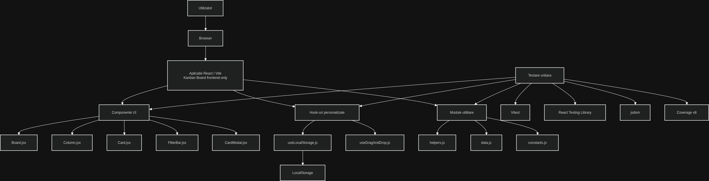
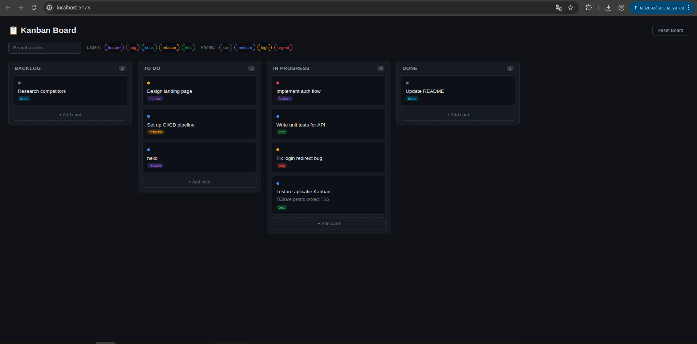
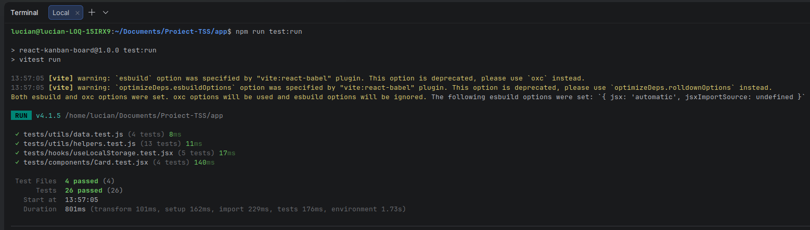
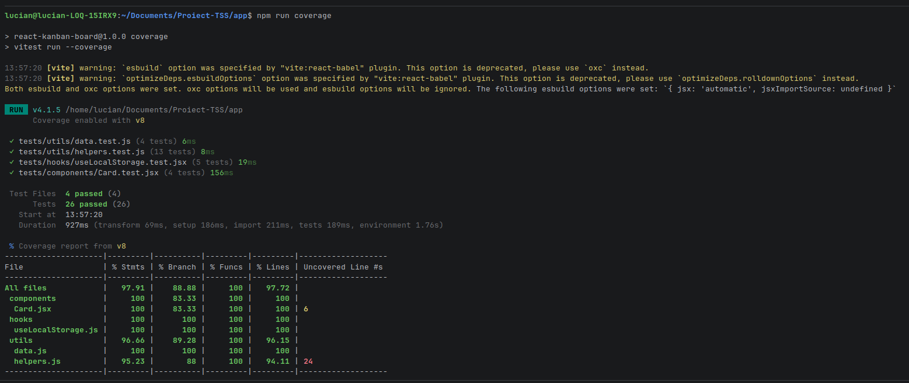
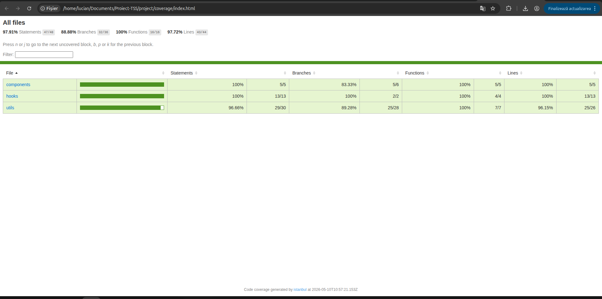

# Documentație proiect TSS - Tema 4: Testare unitară în JavaScript

## 1. Introducere

Acest proiect a fost realizat pentru tema T4 - Testare unitară în JavaScript, din cadrul materiei Testarea Sistemelor Software.

Scopul proiectului este testarea unitară a unor componente JavaScript/React dintr-o aplicație frontend-only de tip Kanban Board. Testarea a fost realizată folosind framework-ul Vitest, împreună cu React Testing Library pentru componentele React.

Proiectul urmărește verificarea comportamentului unor funcții utilitare, hook-uri personalizate și componente React prin teste unitare automate.

## 2. Aplicația aleasă

Aplicația aleasă este o aplicație open-source de tip Kanban Board, dezvoltată cu React și Vite.

Aplicația permite gestionarea task-urilor în coloane și include funcționalități precum:

- afișarea cardurilor pe coloane;
- adăugarea și editarea task-urilor;
- ștergerea cardurilor;
- filtrarea task-urilor;
- salvarea datelor în LocalStorage;
- interacțiuni de tip drag-and-drop.

Aplicația este frontend-only și nu depinde de backend, API extern sau bază de date.
Codul sursă al aplicației se află în directorul /app


## 3. Tehnologii utilizate

Aplicația și testele folosesc următoarele tehnologii:

- JavaScript;
- React;
- Vite;
- Vitest;
- React Testing Library;
- jsdom;
- @testing-library/jest-dom;
- @testing-library/user-event;
- @vitest/coverage-v8;
- LocalStorage.

Am ales Vitest deoarece se integrează foarte bine cu aplicațiile construite cu Vite și permite rularea rapidă a testelor unitare. React Testing Library a fost folosit pentru testarea componentelor React din perspectiva comportamentului observabil de utilizator.

## 4. Configurația hardware și software

Proiectul a fost rulat local pe următoarea configurație:

- Sistem de operare: Ubuntu Linux;
- Editor/IDE: WebStorm / terminal Linux;
- Runtime: Node.js;
- Manager de pachete: npm;
- Browser: Google Chrome;
- Framework testare: Vitest;
- Mediu de testare DOM: jsdom;
- Tool coverage: @vitest/coverage-v8.

## 5. Structura repository-ului

Repository-ul are următoarea structură principală:

```text
Proiect-TSS/
├── app/
│   ├── src/
│   ├── tests/
│   ├── package.json
│   ├── package-lock.json
│   └── vite.config.js
│
├── project/
│   ├── coverage/
│   ├── diagrame/
│   ├── screenshots/
│   ├── README.md
│   ├── strategie-testare.md
│   ├── raport-ai.md
│   └── referinte.md
│
└── README.md
```

Folderul `app/` conține aplicația testată și testele unitare.

Folderul `project/` conține documentația proiectului, capturile de ecran, raportul de coverage, diagrama de arhitectură și raportul despre utilizarea unui tool AI.

## 6. Arhitectura aplicației

Aplicația este o aplicație frontend-only. Utilizatorul interacționează cu aplicația în browser, iar interfața este construită din componente React. Persistența locală a datelor este realizată prin LocalStorage.

Structura logică a aplicației poate fi împărțită astfel:

- `components/` - componentele vizuale ale aplicației;
- `hooks/` - hook-uri personalizate pentru logică reutilizabilă;
- `utils/` - funcții utilitare și date inițiale;
- `LocalStorage` - mecanismul folosit pentru persistența datelor.

Diagrama de arhitectură:



## 7. Componente și module testate

Au fost testate următoarele fișiere:

- `src/utils/helpers.js`
- `src/utils/data.js`
- `src/hooks/useLocalStorage.js`
- `src/components/Card.jsx`

Testele se află în:

- `tests/utils/helpers.test.js`
- `tests/utils/data.test.js`
- `tests/hooks/useLocalStorage.test.jsx`
- `tests/components/Card.test.jsx`


## 8. Strategia de testare

Strategia de testare a urmărit verificarea izolată a funcțiilor, hook-urilor și componentelor React.

Au fost testate:

- generarea datelor inițiale;
- crearea cardurilor;
- filtrarea task-urilor;
- formatarea datelor calendaristice;
- interacțiunea cu LocalStorage;
- afișarea informațiilor unui card;
- acțiuni ale utilizatorului asupra componentei `Card`;
- apelarea callback-urilor pentru editare, ștergere și drag-and-drop.

Au fost folosite cazuri normale, cazuri de frontieră și cazuri de eroare (ex.: citirea unui JSON invalid din LocalStorage)

Strategia completă este descrisă în fișierul:

```text
project/strategie-testare.md
```

## 9. Rularea aplicației

Pentru rularea aplicației:

```bash
cd app
npm install
npm run dev
```

După rulare, aplicația este disponibilă local în browser:

```text
http://localhost:5173
```

Captură rulare aplicație:



## 10. Rularea testelor

Pentru rularea testelor:

```bash
cd app
npm run test:run
```

Rezultatul obținut:

```text
4 fișiere de test trecute
26 teste trecute
0 teste eșuate
```

Captură rulare teste:



## 11. Coverage

Pentru generarea raportului de coverage:

```bash
cd app
npm run coverage
```

Raportul de coverage a fost generat în directorul:

```text
project/coverage/
```

Rezultatele coverage obținute au fost:

| Metrica | Valoare |
|---|---:|
| Statements | 97.91% |
| Branches | 88.88% |
| Functions | 100% |
| Lines | 97.72% |

Captură coverage terminal:



Captură coverage HTML:



## 12. Interpretarea rezultatelor

Rezultatele arată că toate testele unitare implementate au trecut cu succes.

Au fost rulate 4 fișiere de test, cu un total de 26 de teste. Nu am avut teste eșuate.

Rezultatele de coverage indică un grad mare de acoperire pentru modulele testate. Acoperirea la nivel de instrucțiuni este 97.91%, acoperirea pe funcții este 100%, iar acoperirea pe linii este 97.72%.

Testele pentru `helpers.js` verifică funcții utilitare precum generarea de ID-uri, formatarea datelor și filtrarea task-urilor.

Testele pentru `data.js` verifică generarea cardurilor și structura inițială a board-ului.

Testele pentru `useLocalStorage.js` verifică citirea, scrierea, resetarea și tratarea datelor invalide din LocalStorage.

Testele pentru `Card.jsx` verifică afișarea datelor și apelarea callback-urilor la interacțiuni ale utilizatorului.

În concluzie, suita de teste acoperă comportamentul principal al modulelor selectate și oferă încredere că funcționalitățile testate se comportă conform așteptărilor.

## 13. Utilizarea unui tool AI

În cadrul proiectului a fost utilizat ChatGPT pentru asistență în configurarea testelor unitare, identificarea componentelor potrivite pentru testare și generarea /app/tests/ai-generated/useLocalStorage.ai.test.jsx.

Raportul detaliat se află în fișierul:

```text
project/raport-ai.md
```

## 14. Concluzii

Proiectul demonstrează utilizarea testării unitare în JavaScript pentru o aplicație frontend-only dezvoltată cu React și Vite.

Prin folosirea Vitest și React Testing Library au fost testate funcții utilitare, hook-uri și componente React. Aplicația aleasă a fost potrivită pentru tema T4 deoarece are o complexitate medie, nu depinde de backend și permite testarea izolată a logicii JavaScript.

Rezultatele obținute arată că suita de teste acoperă comportamentul principal al modulelor selectate și oferă o bază bună pentru extinderea testării în viitor.

## 18. Referințe

Referințele bibliografice sunt incluse în fișierul:

```text
project/referinte.md
```
