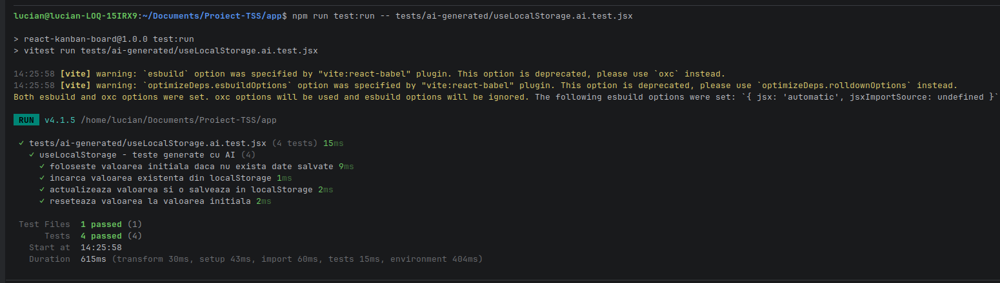

# Raport privind utilizarea unui tool AI în testarea software

## 1. Introducere

În cadrul proiectului pentru tema T4 - Testare unitară în JavaScript, a fost utilizat tool-ul AI ChatGPT pentru asistență în procesul de testare software.

Utilizarea AI a avut ca scop generarea unei suite alternative de teste unitare pentru hook-ul `useLocalStorage`, pentru a putea compara testele scrise manual cu testele generate automat.


## 2. Contextul utilizării AI

Pentru comparația cu AI, a fost ales hook-ul:

```text
src/hooks/useLocalStorage.js
```

Acest hook a fost ales deoarece are o logică clară și importantă pentru aplicație:

- inițializează valoarea din LocalStorage;
- citește o valoare existentă;
- actualizează valoarea;
- salvează valoarea în LocalStorage;
- permite resetarea valorii;
- poate întâlni date invalide în LocalStorage.

## 3. Prompt folosit

Promptul folosit pentru generarea testelor a fost:

```text
Generează teste unitare cu Vitest și React Testing Library pentru un hook-ul de React "useLocalStorage".

Hook-ul returnează un array cu trei elemente:
1. valoarea curentă;
2. o funcție pentru actualizarea valorii;
3. o funcție pentru resetarea valorii.

Testele trebuie să verifice:
- folosirea valorii inițiale când nu există date în LocalStorage;
- citirea unei valori existente din LocalStorage;
- actualizarea valorii și salvarea în LocalStorage;
- resetarea valorii la valoarea inițială.

Scrie codul într-un fișier de test jsx, folosind Vitest, renderHook și act.
```

## 4. Răspuns generat de AI

ChatGPT a generat o suită de teste pentru hook-ul `useLocalStorage`, folosind:

- `describe`;
- `it`;
- `expect`;
- `beforeEach`;
- `renderHook`;
- `act`;
- `localStorage.clear()`.

Codul generat a fost salvat în fișierul:

```text
app/tests/ai-generated/useLocalStorage.ai.test.jsx
```

## 5. Rularea testelor generate de AI

Testele generate de AI au fost rulate separat folosind comanda:

```bash
cd app
npm run test:run -- tests/ai-generated/useLocalStorage.ai.test.jsx
```

Captură cu rularea testelor generate de AI:



## 6. Comparație între testele proprii și testele generate de AI

Pentru comparație, au fost analizate testele proprii din:

```text
app/tests/hooks/useLocalStorage.test.jsx
```

și testele generate de AI din:

```text
app/tests/ai-generated/useLocalStorage.ai.test.jsx
```

### 6.1 Comparație generală

| Criteriu | Teste proprii | Teste generate de AI |
|---|---|---|
| Framework folosit | Vitest + React Testing Library | Vitest + React Testing Library |
| Hook testat | `useLocalStorage` | `useLocalStorage` |
| Testare valoare inițială | Da | Da |
| Testare citire din LocalStorage | Da | Da |
| Testare actualizare valoare | Da | Da |
| Testare resetare valoare | Da | Da |
| Testare JSON invalid | Da | Nu |
| Număr teste | 5 | 4 |
| Nivel de detaliu | Mai ridicat | Mediu |
| Tratare cazuri de eroare | Da | Nu |

### 6.2 Observații

Testele generate de AI au acoperit comportamentele principale ale hook-ului:

- inițializare;
- citire;
- actualizare;
- resetare.

Totuși, testele proprii sunt mai complete deoarece includ și cazul în care LocalStorage conține un JSON invalid. Acesta este un caz important, deoarece aplicația trebuie să se comporte corect chiar și atunci când datele salvate local sunt corupte sau nu pot fi parsate.

## 7. Diferențe identificate

Principala diferență este că testele proprii includ un caz suplimentar de eroare:

```text
LocalStorage conține JSON invalid
```

Acest caz nu a fost inclus în testele generate de AI.

De asemenea, testele proprii folosesc în unele cazuri obiecte ca valori salvate, nu doar string-uri. Acest lucru este mai apropiat de modul real în care aplicația salvează date complexe în LocalStorage.

## 8. Avantaje ale utilizării AI

Utilizarea ChatGPT are următoarele avantaje:

- a generat rapid o suită inițială de teste;
- a propus o structură clară pentru testare;
- a folosit corect `renderHook` și `act`;
- a acoperit scenariile principale;
- a ajutat la compararea abordării manuale cu o abordare automată.

## 9. Limitări ale testelor generate de AI

- nu au inclus cazul de JSON invalid;
- nu au verificat comportamentul cu obiecte complexe;
- nu au analizat toate ramurile posibile ale hook-ului;
- nu au fost adaptate complet la contextul aplicației;
- au necesitat verificare și rulare manuală.

Acest lucru arată că AI poate ajuta în procesul de testare, dar rezultatele trebuie validate de developer.

## 10. Interpretare

Testele generate de AI sunt utile pentru generarea rapidă a unei suite de bază, dar nu sunt suficiente pentru o testare completă.

Comparativ cu testele proprii, testele generate automat au acoperit scenariile normale, dar au omis un caz important de eroare. Din acest motiv, suita proprie este mai completă și mai potrivită pentru aplicația testată.

AI-ul poate accelera procesul de scriere a testelor, dar nu înlocuiește analiza manuală a codului și identificarea cazurilor speciale.

## 11. Concluzie

În cadrul proiectului, ChatGPT a fost util pentru generarea unei suite alternative de teste unitare pentru hook-ul `useLocalStorage`.

Comparația a arătat că testele generate de AI acoperă cazurile principale, dar nu includ toate situațiile relevante. Testele proprii au fost mai complete, deoarece au inclus și tratarea unui JSON invalid în LocalStorage.

Prin urmare, utilizarea AI este utilă ca instrument de sprijin în testarea software, însă rezultatele generate trebuie verificate, adaptate și completate de o persoană reală.
